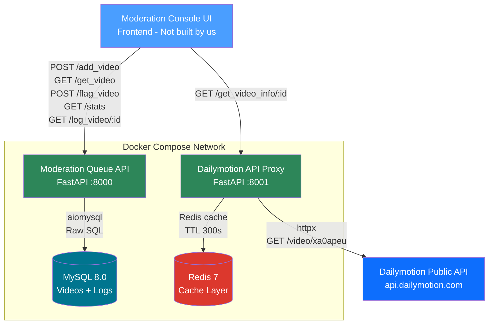
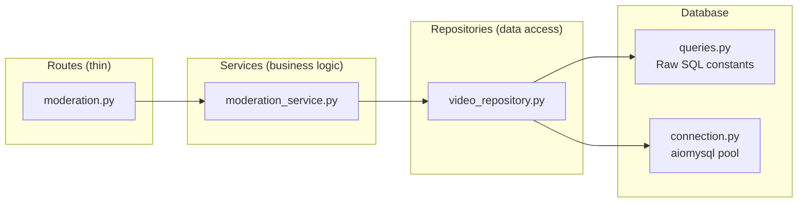
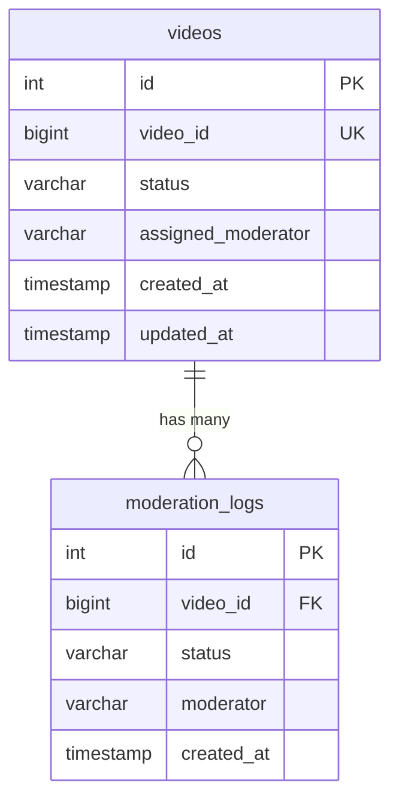
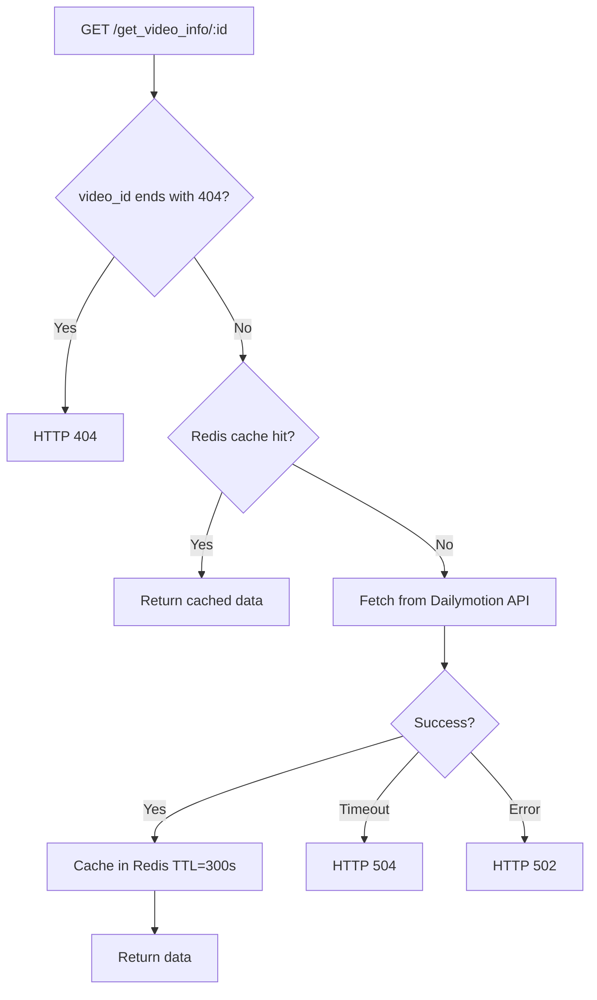

# Architecture

## System Overview

## Moderation Queue — Internal Architecture

## Database Schema

## Concurrency Model

When multiple moderators call `GET /get_video` simultaneously:

1. **Check existing assignment** — If the moderator already has a pending video, return it (idempotent)
2. **Get candidates** — `SELECT video_id ... WHERE status='pending' AND assigned_moderator IS NULL` (no lock)
3. **Lock one** — For each candidate, `SELECT ... WHERE video_id=X FOR UPDATE SKIP LOCKED`
4. **Assign** — `UPDATE ... SET assigned_moderator=moderator`

This two-step approach avoids MySQL/InnoDB locking all candidate rows during `ORDER BY` scans.

## Proxy Caching Flow

